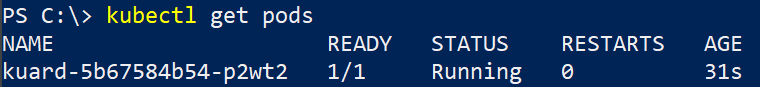
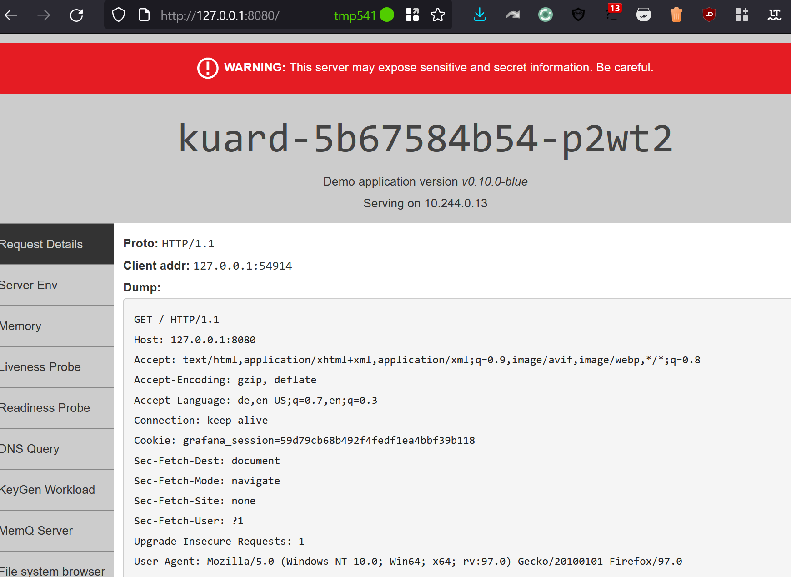
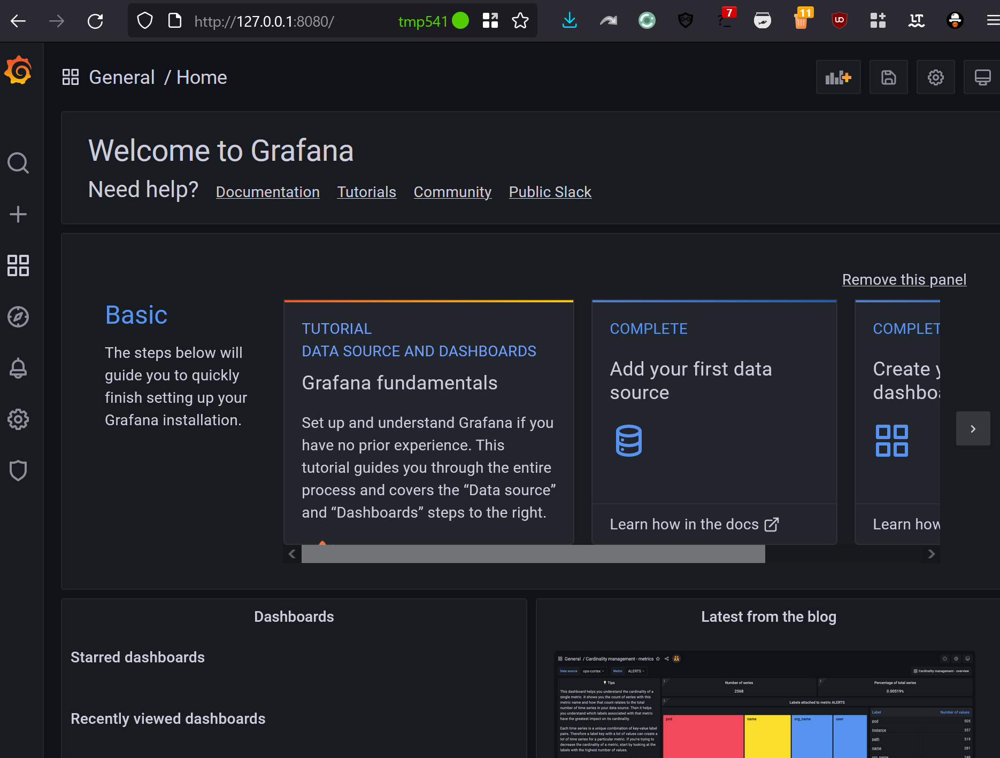
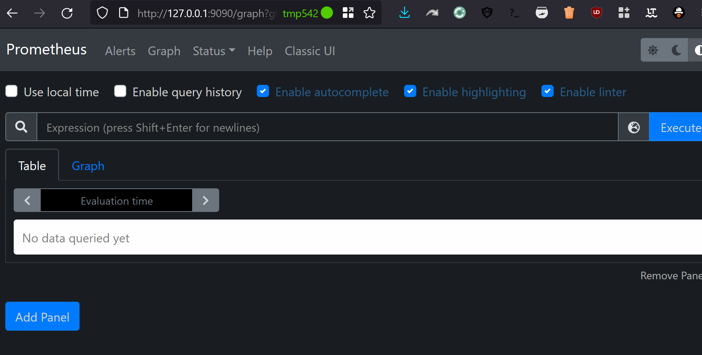
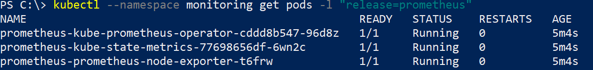

# Basic Setup Kubernetes Cluster

## System
Microsoft Windows 10 21H2  
Docker und Chocolatey sind vorinstalliert.

## Zeitaufwand 
~ 45min

## Kommandos
```powershell
# Install Kubernetes & Helm
choco install kind kubernetes-helm
kind create cluster --name c1

# Create kuard helm chart
helm create kuard
# Change in ./kuard
helm lint kuard
helm package kuard
helm install kuard ./kuard-0.10.0.tgz

# Install monitoring system
kubectl create namespace monitoring
## GitHub install instruction project kube-prometheus-stack
helm repo add prometheus-community https://prometheus-community.github.io/helm-charts
helm repo update
helm install prometheus prometheus-community/kube-prometheus-stack --namespace monitoring

# Grafana
## Get Admin data (Base64)
kubectl get secret --namespace monitoring prometheus-grafana -o yaml
## Set Port-Forward
kubectl port-forward service/prometheus-grafana 8080:80 --namespace monitoring

# Prometheus
kubectl port-forward service/prometheus-kube-prometheus-prometheus 9090:9090 --namespace monitoring

```
## Screenshots

### Kuard:





### Grafana:



### Prometheus:



### Pods:



