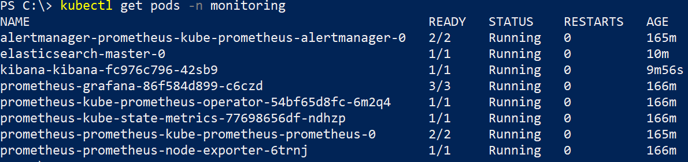
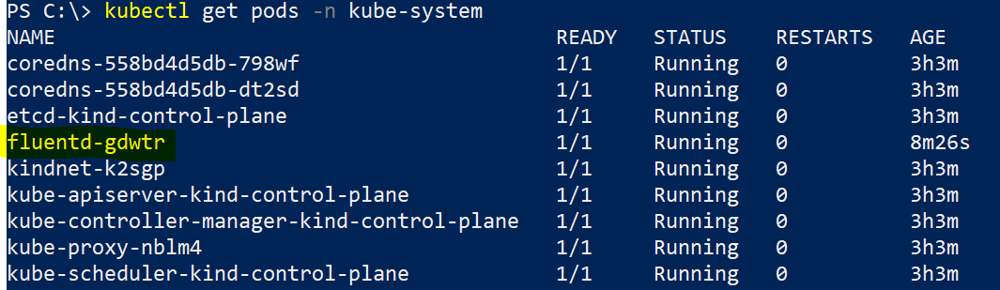
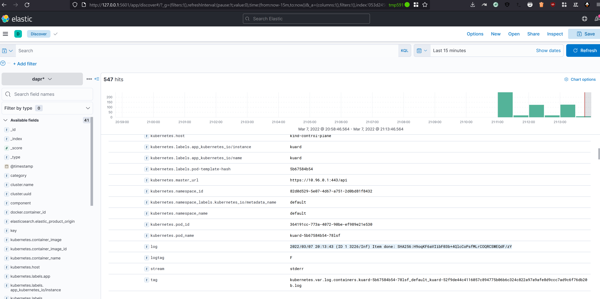

# Wie würde eine Logging Lösung in einem Kubernetes Umfeld aussehen?

## Zeitaufwand 
~90min

## Antwort

Auf jedem Knoten im Cluster wird ein `logging agent` ausgeführt, dieser liest Logs die von Pods ausgeben werden und schickt diese ans Backend.

Damit der Agent auf jeden Knoten ausgeführt wird, definieren wir ihn als DaemonSet auch wenn das im Kind-Cluster keine wirkliche Anwendung findet mit einem Knoten.

Als Agent verwendet ich die Software Fluentd und als Backend ElasticSearch und zur Aufbereitung der Daten Kibana.

## Kommandos

```
helm repo add elastic https://helm.elastic.co
helm repo update

helm install elasticsearch elastic/elasticsearch -n monitoring --set persistence.enabled=false,replicas=1
helm install kibana elastic/kibana -n monitoring

kubectl apply -f ./fluentd-config-map.yaml
kubectl apply -f ./fluentd-dapr-with-rbac.yaml

```

## Screenshots





