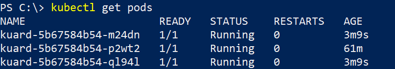

# Wie kann mit Kubernetes Boardmitteln sichergestellt werden, dass die Applikation mit einer hohen Anzahl an Requests auskommt?

## Antwort
In dem Deployment Manifest der Anwendung, muss für die ReplicaSet Ressource eine größere Anzahl an gleichzeitig laufenden Pods (Replicas) definiert werden. 

## Zeitaufwand 
~ 10min

## Kommandos
```powershell
# Set replicas: 3
kubectl edit deployments kuard
```

## Screenshots


