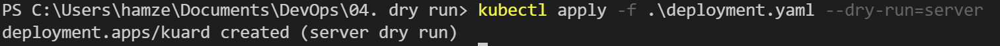

# Wie kann man Fehler im Templating vor einem Deployment erkennen?

## Zeitaufwand 
~ 10min

## Antwort

Mir wäre da nur die Möglichkeit bekannt einen `dry-run` auszuführen, womit die Deployment Datei auf dem Server nicht wirklich durchgeführt wird.

## Kommandos

```
kubectl apply -f .\deployment.yaml --dry-run=server
```

## Screenshots

