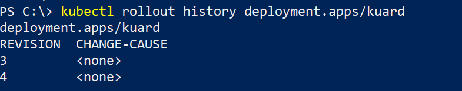

# Welche Möglichkeit gibt es ein fehlgeschlagenes Deployment auf eine frühere Version zurückzusetzen?

## Zeitaufwand 
~ 15min

## Antwort
Nachdem eine Deyploment Ressource bearbeitet wurde, wird eine Rollout History aufgebaut, diese kann mittel `kubectl rollout` verwaltet werden. Um ein Deployment zurückzusetzen, muss folgender Befehl ausgeführt werden: `kubectl rollout undo deployment/XXX`

Zusätzlich gäbe es die Möglichkeit, die Mainfestdatei in einen Repository (z.B. Git) zu verwalten. Die Mainfestdatei könnte mittels `git reset` auf den älteren Stand gebracht werden, und dann mittel `kubectl apply` eingespielt werden.

## Kommandos

```
kubectl rollout undo deployment/kuard
```

## Screenshots

### Kuard:


